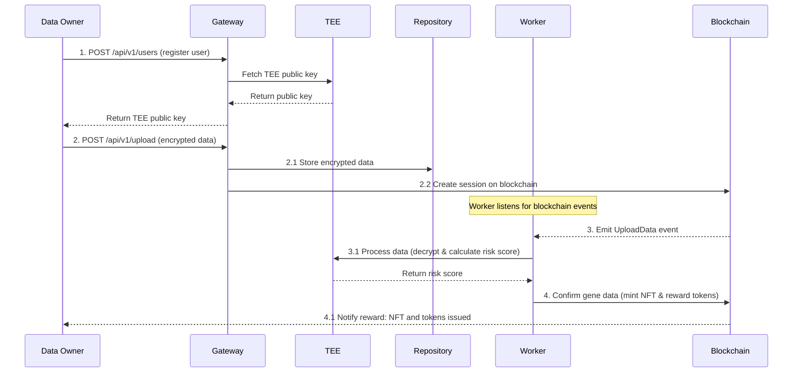

# Genomic Service

## Overview

The Genomic Service is a blockchain-based application designed to handle genomic data securely. It leverages Ethereum smart contracts to manage data transactions and ensure data integrity.

## Sequence Diagram

## Components

### 1. Adapters

- **Blockchain**
  - [blockchain_service.go](./adapters/blockchain/blockchain_service.go): Manages interactions with the blockchain, including transaction handling and contract interactions.
  - **Contracts**: Contains auto-generated Go bindings for Ethereum smart contracts:
    - [controller.go](./adapters/blockchain/contracts/controller.go)
    - [gene_nft.go](./adapters/blockchain/contracts/gene_nft.go)
    - [pcsp_token.go](./adapters/blockchain/contracts/pcsp_token.go)

- **Repositories**
  - [genetic_data_repository.go](./adapters/repositories/genetic_data_repository.go): Handles storage and retrieval of genetic data.
  - [user_repository.go](./adapters/repositories/user_repository.go): Manages user data storage and retrieval.

- **TEE (Trusted Execution Environment)**
  - [tee_services.go](./adapters/tee/tee_services.go): Provides services related to secure data processing and risk assessment.

### 2. Bootstrap

- [all.go](./bootstrap/all.go): Initializes the application with necessary dependencies and configurations.
- [build.go](./bootstrap/build.go): Contains build metadata such as version, commit hash, and build time.

### 3. Config

- [chain_properties.go](./config/chain_properties.go): Defines blockchain configuration properties.
- [default.yml](./config/default.yml): Default application configuration.
- [local.example.yml](./config/local.example.yml): Example configuration for local development.

### 4. Controllers

- [user_controller.go](./controllers/user_controller.go): Handles HTTP requests related to user operations, such as data upload.

### 5. Jobs

- [filter_logs_job.go](./jobs/filter_logs_job.go): A cron job that filters blockchain logs and processes events.

### 6. Models

- [genetic_data.go](./models/genetic_data.go): Defines the structure for genetic data.
- **Requests**: Contains request models:
  - [create_user_request.go](./models/requests/create_user_request.go)
  - [upload_data_request.go](./models/requests/upload_data_request.go)
- [user.go](./models/user.go): Defines the user model.

### 7. Routers

- [router.go](./routers/router.go): Sets up HTTP routes for the application.

### 8. Tests

- [actuator_test.go](./tests/actuator_test.go): Tests for application health and info endpoints.
- [test_suite.go](./tests/test_suite.go): Initializes the test suite with necessary configurations.

### 9. Main

- [main.go](./main.go): Entry point of the application, starting the service with all components.
